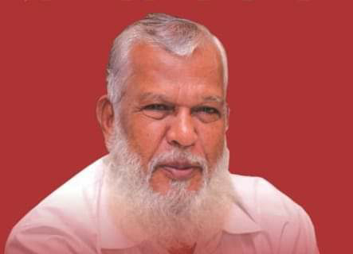

جالنہ شہر خصوصی پیشکش مستقل تعارفی سیریزقسط۰۱؀ روشن چراغ - میرا شہر،میرے لوگ 
خصوصی مہمان - پسماندہ طبقات کی بےباک آواز،آل انڈیا مسلم او بی سی آرگنائزیشن کے صدرمؤسس عالیجناب شبیراحمدانصاری صاحب

آپ کی پیدائش نومبر سن ۱۹۴۸ءکوایک غریب جُلاہا(بُنکر)خاندان میں ہوئی۔والدِبزرگوار مولوی محمد داؤد انصاری صاحب بُنکرکاکام کرکے عربی،دینی دریس کاکام انجام دیتے تھے۔سقوطِ حیدرآباد کے سانحہ نے بدترین صورتِ حال پیداکردی تھی۔جس میں مسلمان ہراعتبار سے کمزور ہوچکے تھے۔اپنی خود نوشت میں ایک جگہ موصوف یوں رقمطراز ہیکہ۔"مجھے تو اپنی تاریخ پیدائش بھی معلوم نہیں البتہ والدہ محترمہ فرماتی تھی کہ یٹا جب تم مادرِ شکم میں تھے اور تمہیں تولد ہونے میں دو ڈھائی ماہ کا عرصہ باقی تھا کہ پولس ایکشن کا بدترین سانحہ پیش آیا جو مسلمانوں کے لئے انتہائی پریشانی اور مصیبتیں لایا تھا"۔ ان حالات میں دل چاہتا تھا کہ باولی میں چھلانگ لگا کر خود اور آنے والے بچے کو نجات دے دی جائے مگر تمہارے نانا اور والد محترم جوانتہائی متقی پرہیزگار تھے مجھے حوصلہ دیا اور حالات کا مقابلہ کرنے کی ترغیب دلائی۔ خداوند قدوس کی بارگاہ میں شبانہ روزدعائیں مانگتے اور مصیبتوں سے نجات مل جانے کی سبیل کی دھائی رب العزت کو دیتے رہے پروردگار عالم نے ان کی دعاؤں کو شرف بولیت عطا کیا اور مصیبت کے دن تمام ہوئے۔ حالات اعتدال پر آ گئے اور ازسرِنو زندگی کا آغاز کیا گو کہ معاشی حالت پہلےسے بھی زیادہ بدتر ہوچکی تھی لیکن اللہ رب العزت کے فضل و کرم سے تمام مراحل طئے ہوئے اور تمہاری پیدائش 1948 کے اواخرمیں ہوئی اس طرح والدہ صاحبہ کی معلومات کی بنا پر میری ولادت 1948 کے اواخر کی ہیں۔ معاشی بدحالی تنگدستی اور فاقہ مستی کا حال یہ تھا کہ شام میں طعام کا انتظام رہتا تو صبح کی فکر رات جاگ کر گزارنی پڑتی خیر ان سخت ترین حالات میں مدرسے میں شریک کیا گیا اسکول کی فیس ادا نہ کرنے پر تین مرتبہ اسکول سے نام خارج کیا گیا مگر کسی طرح میٹرک تک تعلیم مکمل کی والدین اور نانا بہت ہی دیندار لوگ تھے اس لیے ظاہر ہے ھماری پرورش بھی مذہبی نہج پر ہوئی اس زمانے میں جُلاہے یعنی بُنکراوردوسری پیشہ ور برادریوں کو متوسط اور اعلی طبقہ بڑی حقارت کی نظر سے دیکھتا تھا اور منہ کے تھوک سے دھاگہ مل کر کپڑےبننے والوں کی ہم سے کیا برابری کہاں وہ اور کہاں ہم کی ذہنیت تھی بندے کو سنِ طفلی میں ہی اس ذہنیت سے بہت کوفت ہوتی تھی دین داری کی وجہ سے بندہ قرآن و حدیث کی تعلیمات سے چندے آگاہ تھا قرآن میں بنیادی بات جو فرمائی گئی وہ مساوات کی۔۔ ہرکلمہ گو مسلمان ہے،ذات پات فرقہ یا جماعت وغیرہ کا تصور نہیں ہے بلکہ ہر کلمہ گو آپس میں بھائی ہیں پھر یہ لوگ ہم لوگوں کو اتنی حقارت کی نگاہ سے کیوں دیکھتے ہیں بنکری یا اور پیشہ ذات یا مذہب نہیں بلکہ پیشہ ہیں جو گزر اوقات کا ذریعہ ہے اس زمانے میں مسلم خاکروب یعنی بھنگی یا مہتر ہوا کرتے تھے جو لوگوں کے گھر جاکر ان کا فضلہ بکیٹ میں سمیٹ کر اپنے سر پر رکھ کر ڈھوتے تھے دوسرے لفظوں میں گزر اوقات کے لئے وہ یہ پیشہ اپنائے ہوئے تھے پھر کیا وہ کلمہ گو نہیں تھے کیا وہ مسلمان نہیں تھے اور قرآن کریم میں کی گئی تعریف کے بموجب وہ مساوات کی بنیادی سطح سے نیچے کیسے ہو سکتے تھے یہی خیالات ناچیز کوعہد طفلی میں ہی پریشان کئے رہتے اور میں سوچتا رہتا کہ ضرور ان خرافات  کا تدارک ہونا چاہیے اس کے لئے مجھے پیشہ وربرادریوں کی ذہن سازی کرنا ہوگی جس کے بغیر مساواتی علمبرداری کا پرچم لہرانا ناممکن نہیں تو مشکل بلکہ بے حد مشکل ضرورہوگا۔۔خیر خدا خدا کر کے میٹرک کا امتحان بھی پاس کر لیا بعدازاں ممبئی میں ایک رشتے دار کی اعانت اور جذبۂ ہمدردی سےکالج میں داخلہ مل گیا لیکن حالات دگرگوں ہوتے گئے اور اعلی تعلیم جو ایک خواب تھا ترک کرنا پڑی اور ناچیز بے نیل و مرام جالنہ واپس آگیا آخر گزر اوقات اور والدین کو سہارا دینا بھی لازمی امر تھا اس لئے ابتدا میں پیشۂ خیاطی یعنی درزی سےمنسلک ہوکر گزر اوقات کے لئے خیاطی کو ذریعہ معاش بنایا دوران خیاطی بھی بنکروں اور دیگر پیشہ ور برادریوں کے تعلق سے بےچینی برقرار تھی انکےاستحصال سے ہمیشہ دلبرداشتہ رہتا اور اس استحصال سے گلو خلاصی اور بنکروں اور دیگر دیگر پیشہ وربرادریوں کو اپنا مقام اور وقار دلانے کے لئے بے چین رہتا متعدد متعلقہ لٹریچر پڑھنے لگا اور اخبار بینی نیز اس وقت کے بافہم اور مذہبی امور سے واقف حضرات سے ربط بڑھاتا رہا ان سے اس سلسلے میں ہمیشہ سوالات کرتا اور مسائل کا حل دریافت کرتااور خود بھی مسئلے کے حل کے لئے کوشاں رہتا لیکن بدقسمتی سے ایک بھی بزرگ یا بافہم مولوی یا مولانا اور قائد و رہنما میری مناسب اور تشفی بخش رہبری نہ کر سکے بلکہ بعض اوقات چلو میاں ابھی تم بچے ہو جاؤ ان مسائل میں خود کو الجھانے کے بجائےکمانےکی فکر کرو اور تنگدستی اور فاقہ کشی سے نجات کا راستہ ڈھونڈو وہ بہتر ہوگا ان مسائل میں پڑھ کر تم کچھ بھی حاصل نہ کر سکو گے بلکہ مزید پریشانیاں بڑھا لو گے اس طرح کے جوابات بھی موصول ہوئے۔ پیشہ خیاطی جاری تھی کہ 1967 میں گورنمنٹ آف مہاراشٹرا نے پہلی بار ریاست میں او بی سی کی فہرست جاری کی جس میں چند مسلم پیشہ ور برادریوں کے بھی نام شامل تھے پڑھ کر ناچیز کے حیرت کی انتہا نہ رہی ذہن میں ایک بجلی سی کوندی کہ آج تک اسے جس پریشانی نے دو بھر کر رکھا ہے اس کا حل نکلنےوالا ہے لیکن سوال یہ تھا کہ جب میں او بی سی اور وہ بھی مسلمانوں میں ریزرویشن کی بات کرتا قرآن اور حدیث کا واسطہ دے کرمجھے انتباہ دیا جاتا خبردار مسلمانوں میں ذات پات فرقہ یا جماعت کا تصور ہی نہیں ہے تو مساوات کے علمبردار مذہب اسلام کےاصولوں کے خلاف تم ریزرویشن کے لئے جدوجہد کرنے اور حکومت سے چند سہولتیں حاصل کرنے کی کیوں سوچتے ہو پھر مجھے احساس ہواکہ برہمن اور ہندو لابی کے حصار میں مسلمانوں کو ایک جمہوری ملک میں رہتے ہوئے دستور میں ہر مذہب و ملت کے شہری کو مساوی   حقوق دیے گئے ہیں تو اس کی روٗ سے ہمیں ان سہولتوں اور رعایتوں کے لئے جدوجہد کرنا ضروری ہے اس میں قرآن اور حدیث کےاحکامات کی خلاف ورزی کہاں ہوتی ہیں مسلم عوام کے ذہن میں ریزرویشن کے تعلق سے جو تصور ہے اس کو دور کرنا ہوگا اور تمام مسلم پیشہ ورانہ برادریوں کو ایک پلیٹ فارم پر لانا ہوگا اس جدوجہد کو لے کر اپنوں اور بیگانوں سے بغاوت کرکے اکیلا ہی نکل پڑا مجھے جناردھن پاٹل ممبئی سے بہت بڑی مدد ملی جوو بی سی کی تحریک مہاراشٹر میں چلا رہے تھے اور میں نے بھی مہاراشٹر اسٹیٹ مسلم او بی سی  آرگنائزیشن کی بنیاد سنہ 1978 میں ڈال دی۔"
(بشکریہ روزنامہ سیکولر قیادت دہلی)۔

معزز قارئین۔۔!شبیراحمد انصاری کی زندگی جن عظیم الشان کارناموں کا مرقع ہے اور بیسویں صدی کے آزادی انقلاب کے بعد جو حیثیت و مقام ان کو اپنی جفاکشی سخت محنت،لگن،تڑپ اور جستجوں کے نتیجہ میں پورے ملک میں حاصل رہی اس کا مختصر تذکرہ بھی ایک وقیع مضمون کی شکل میں ممکن نہیں گذشتہ ستر سالوں میں جو حیرت انگیز انقلابات ملک کے سیاسی،اقتصادی،تعلیمی و تمدنی شعبہ جات میں واقع ہوئے ہیں ان کا غیرمعمولی اثر موصوف کی زندگی کے ہر مرحلہ میں نظر آتا ہے اور جب تک ان واقعات کا تفصیل کے ساتھ ذکر نا کیا جائے جو انکی قومی ملی سیاسی سماجی اور تعلیمی خدمات کے محرک ہوئے یہ امید نہیں کی جاسکتی ہیکہ موصوف کی حقیقی عظمت اور ان کے کارناموں کی واقعی اہمیت واضح ہوسکےگی۔تاہم موصوف کی حیات و خدمات پر بیشتر رسائل و اخبارات میں توصیفی و سوانحی خاکے مرتب کئے جاچکے ہیں یہاں پر ہمارا مطمحِ نظر مذکورہ شخصیت کی حیات کے ان ناگفتہ بہ حالات کا تعارف و تذکرہ ہے جس میں انہوں نے پست ہمتی،ڈر خوف اور مایوسی سے مقابلہ کرکے پورے ملک میں اپنا منفرد مقام بنایا اعیانِ سلطنت اور سیاسی پارٹیوں کو پسماندہ طبقات کے مسائل کی یکسوئی پر سوچنے اور لائحہ عمل بنانے کے لئے جھنجوڑ کر رکھدیا۔۔۔
تاکہ نوخیزنسل اس مردِ قلندر کی زندگی کو اپنے لئے مشعلِ راہ بنائے اور مشکل ترین حالات میں عزم مصمم اور اوالعزمی و ثابت قدمی کیساتھ ملکی قومی اور ملی و مذہبی مفاد کے حق میں اپنی قیمتی صلاحیتوں کو کارگر بنائیں۔۔
                  
اللہ رب العزت شبیراحمد انصاری صاحب کا سایہ ہمارے سروں پر تا دیر قائم و دائم رکھے صحت عافیت عطا فرمائے۔۔غلطیوں،کوتاہیوں کو معاف فرمائے،سئیات کو حسنات سے مبدل فرمائے۔دنیوی سکون و اخروی راحت و مغفرت نصیب فرمائے۔
آمین یا رب العالمین

✍🏻تحریروپیشکش۔۔۔
•┄┅══❁✿عامرفہیم راہیؔ✿❁══┅┄•​